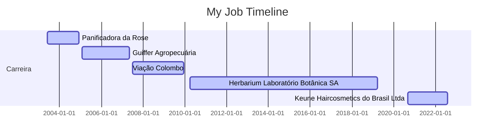

# Sejam bem vindos ao meu repositório! 
## Eu me chamo Jardel, tudo bem?

### My background

- Sou técnologo em **Logística** pela **PUC/PR** em 2012;
- Pós graduado em **Gestão Financeira, Custos e Formação de Preço** pela **Universidade Positivo** em 2016;
- Atualmente estou estudando **análise de dados, Business Intelligence e programação**, com foco nas linguagens **SQL e Python** e na ferramenta de visualização de dados **Power BI**;
- Trabalho como **Assistente de Logística**, e com o conhecimento adquirido em programação consegui automatizar e melhorar os relatórios diários;
- Meu principal objetivo é **migrar** para a área de **tecnologia**, para atuar principalmente como **analista de dados**.

### Cursos Online

* 2022-07   Conquer : Lógica de Programação
* 2022-07   Conquer : SQL: A Linguagem dos bancos de dados
* 2022-01   Conquer : Produtividade e Gestão do Tempo
* 2022-01   Power BI Experience : Trilha Express
* 2021-11   Conquer : Negociação e Influência
* 2022-01   FIAP : Business Intelligence
* 2021-08   Conquer : Comunicação e Oratória
* 2022-01   Udemy : Resumo BI - Fundamentos em Business Intelligence
* 2022-01   Fundação Bradesco : Fundamentos em Lógica de Programação
* 2020-05   Conquer : Inteligência Emocional
* 2020-04   Lit Saint Paul  : Técnicas de Negociações

  <a href="https://github.com/JardelSilva-86">
  
  

 
 

    
 

 
 ### Tools :
 
  
  
  
  
  
  
  

